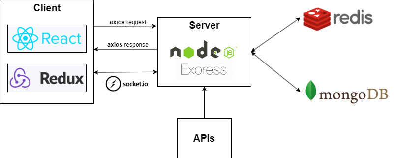

<h1 align='center'>
  Welcome! Investment Portfolio Tracker - BitHodling
</h1>

A smart, user-friendly and responsive website designed to help you effectively manage your investment portfolio.
 
Visit website <a href="https://bithodling.vercel.app/">here</a>

    
    
    
    
    
    
    
    
    
    

## Built with

- **Client**: ReactJS, Redux
- **Server**: NodeJS, ExpressJS
- **Cache**: Redis
- **Database**: MongoDB

    

## Screenshots

### Login

    

### Register

    

### Forgot Password

    

### Homepage

    

### Add Transaction

    

### Detail Table

    

